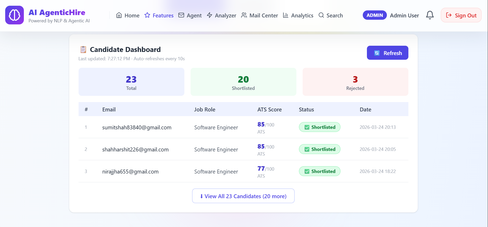
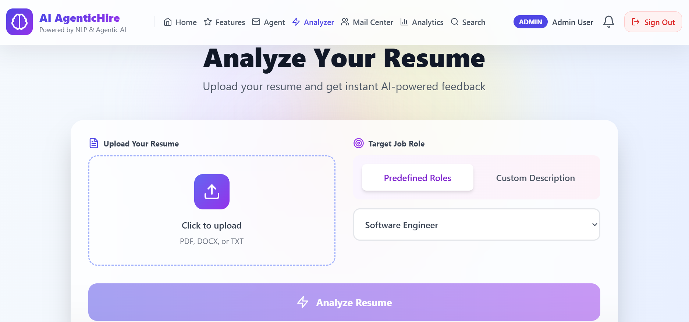
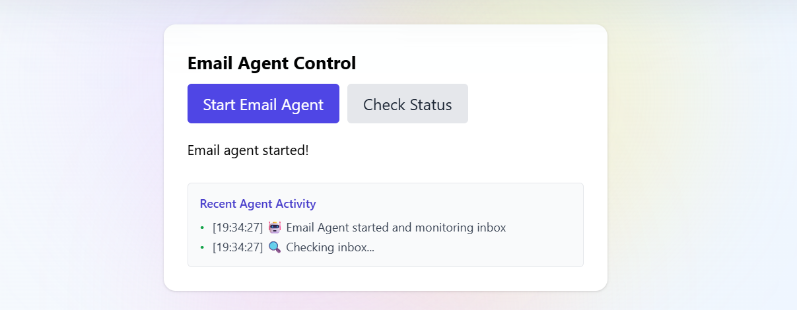
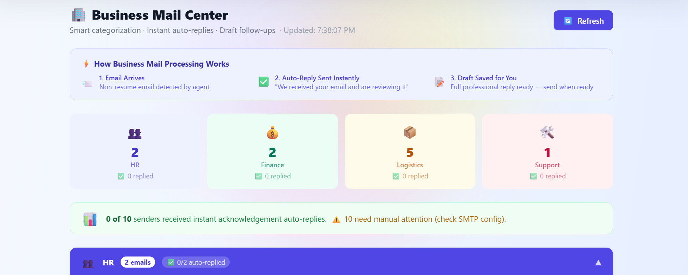
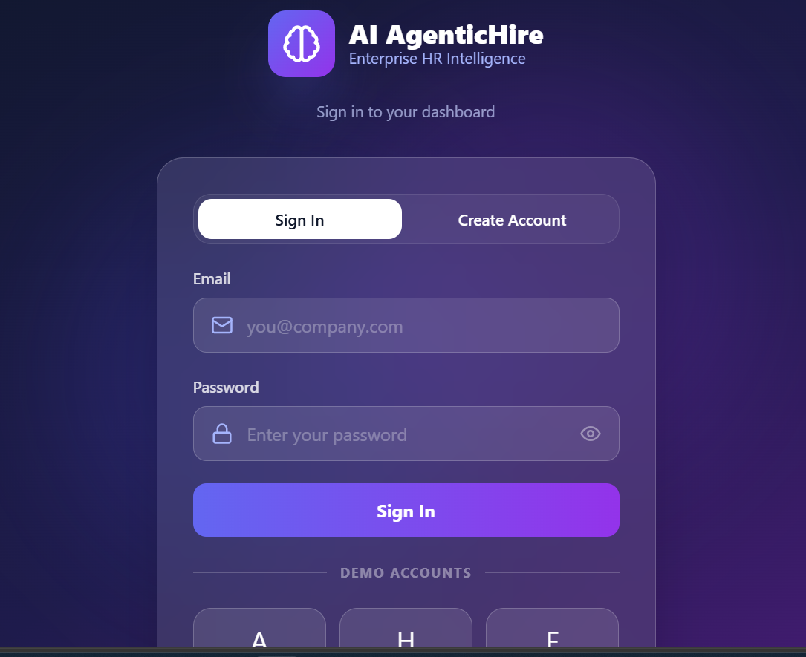
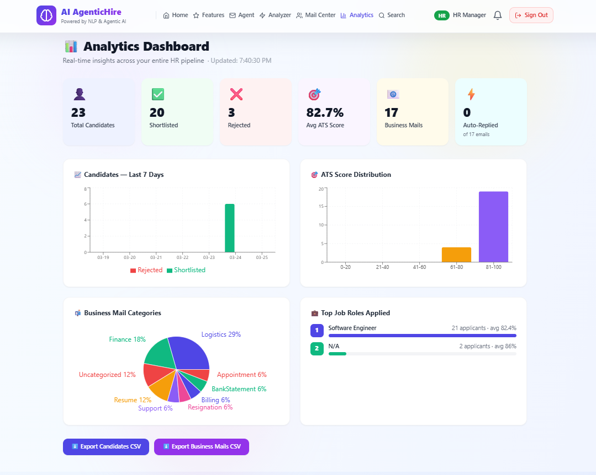

<div align="center">
*n


# 🤖 AI AgenticHire
### Enterprise Recruitment Automation Platform

**AI-powered resume screening · Automated inbox monitoring · Smart email classification · Real-time candidate dashboards**

[📸 Screenshots](#-screenshots) · [⚡ Quick Start](#-quick-start) · [🔌 API Reference](#-api-reference) · [🗺️ Roadmap](#-roadmap)

</div>

---

## 📌 Overview

**AI AgenticHire** is a full-stack enterprise hiring automation platform that removes human bottlenecks from the recruitment pipeline. It monitors a company's Gmail inbox around the clock, intelligently identifies resumes, scores them using NLP across 5 dimensions, classifies all other business emails into categories (Finance, Logistics, etc.), routes them to the correct Gmail labels, and sends personalised auto-reply emails to candidates — all with zero manual intervention.

Built iteratively across 5 versions from a simple resume analyzer to a complete enterprise platform.

```
Candidate sends email  →  Agent detects it  →  Resume? Score + Reply
                                            →  Invoice? Route to Finance label
                                            →  Delivery? Route to Logistics label
                                            →  General? Route to Uncategorized
```

---

## ✨ Features

### 🧠 AI Resume Analysis
- Scores resumes across **5 dimensions**: Skills Match, Experience Strength, Education, Keyword Optimization, ATS Compatibility
- Supports **PDF, DOCX, and TXT** formats with magic-byte validation
- Configurable **ATS threshold** (default 70) — resumes above it are auto-shortlisted
- Sends rich **HTML auto-reply** to candidates with their score breakdown and improvement tips
- Supports **6 predefined job roles** and custom job description input

### 🔍 Semantic Skill Matching
- Goes beyond keyword matching — detects **"Containerization"** when the job requires **"Docker"**
- **45-cluster synonym map** (Tier 1) covering the most common tech skill equivalents
- Optional **cosine similarity** via `sentence-transformers` (Tier 2, threshold: 0.55)
- Score blending: `60% keyword score + 40% semantic score`

### 📧 Automated Email Agent
- Monitors Gmail inbox every **60 seconds** via IMAP SSL
- Uses **UID-based fetching** (not sequence numbers) — handles multiple emails in one cycle without crashes
- Pre-fetches all raw bytes before processing — single expunge at end of batch
- **DOS Protection**: rate limiting (3/sender/hr), file size limits (5MB), magic byte validation, blocked sender list
- Processes up to **20 emails per cycle**

### 📂 Smart Email Classification
- Emails without resume attachments are **automatically classified**, not ignored
- 4 categories: `Finance` · `Logistics` · `Resume` · `Uncategorized`
- Subject line keywords count **double** for classification accuracy
- Routes email to the matching **Gmail label** in real time
- Saved to database and visible in the Business Mail dashboard

### 🔐 Role-Based Authentication
- **JWT authentication** with SHA-256 + salt password hashing
- Two roles: `admin` (full access) and `user` (analyzer + feedback)
- Token stored in browser localStorage, validated on every page load

### 📊 Candidate Dashboard & Analytics
- Real-time table of all processed candidates with ATS scores and shortlist status
- Analytics dashboard with score distribution, status breakdown, and job role charts
- Notification bell, search/filter, and CSV export


## 🛠️ Tech Stack

| Layer | Technology |
|-------|-----------|
| **Frontend** | React 18, Vite, Tailwind CSS, Lucide Icons |
| **Backend** | FastAPI (Python), Uvicorn (ASGI server) |
| **Database** | SQLite (`candidates.db`) — 4 tables |
| **Email** | `imaplib` (IMAP SSL read) + `smtplib` (SMTP send) |
| **NLP / AI** | Custom keyword engine, optional `sentence-transformers` |
| **PDF Parsing** | `pdfplumber` |
| **DOCX Parsing** | `python-docx` |
| **Auth** | `PyJWT`, SHA-256 + random salt |
| **Environment** | `python-dotenv` |

---

## 🏗️ Architecture

```
┌─────────────────────────────────────────────────────────┐
│                    React Frontend                        │
│  Navbar (dropdown) · Analyzer · Dashboard · Features    │
│                  localhost:5173                          │
└──────────────────────┬──────────────────────────────────┘
                       │ REST API (fetch / axios)
┌──────────────────────▼──────────────────────────────────┐
│                  FastAPI Backend                         │
│                  localhost:8000                          │
│                                                          │
│  /analyze   /auth/*   /candidates   /business-emails    │
│  /feedback  /applications/*   /agent-log   /job-roles   │
│                                                          │
│  ┌─────────────────┐    ┌───────────────────────────┐   │
│  │   NLP Engine    │    │   Background Thread        │   │
│  │ skill matching  │    │   EmailAgent (daemon)      │   │
│  │ ATS scoring     │    │   60s IMAP poll loop       │   │
│  └─────────────────┘    └───────────────────────────┘   │
│                                                          │
│  ┌───────────────────────────────────────────────────┐  │
│  │            SQLite  (candidates.db)                 │  │
│  │  candidates · categorized_mails · feedback         │  │
│  │  job_applications                                  │  │
│  └───────────────────────────────────────────────────┘  │
└─────────────────────────────────────────────────────────┘
                       │ IMAP SSL / SMTP
              ┌────────▼────────┐
              │   Gmail Inbox   │
              │  Resume emails  │
              │  Business mails │
              └─────────────────┘
```

### Email Processing Flow

```
New UNSEEN email detected
        │
        ├─ Blocked sender?      → Reject silently
        ├─ Rate limited?        → Reject (3/sender/hr)
        ├─ Email > 10MB?        → Reject
        │
        ├─ Has attachment (PDF/DOCX/TXT)?
        │       ├─ Magic bytes valid?
        │       ├─ File < 5MB?
        │       └─ YES → Extract text → AI Score → Save DB → Auto-reply
        │
        └─ No attachment?
                └─ Classify (Finance / Logistics / Resume / Uncategorized)
                        → Save to categorized_mails
                        → Apply Gmail label
```

---

## 🗄️ Database Schema

```sql
-- Processed job applicants
CREATE TABLE candidates (
    id           INTEGER PRIMARY KEY AUTOINCREMENT,
    email        TEXT,
    job_role     TEXT,
    ats_score    INTEGER,
    status       TEXT,           -- 'Shortlisted' or 'Rejected'
    processed_at TIMESTAMP DEFAULT CURRENT_TIMESTAMP
);

-- Business emails (no resume attachment)
CREATE TABLE categorized_mails (
    id           INTEGER PRIMARY KEY AUTOINCREMENT,
    from_email   TEXT NOT NULL,
    from_name    TEXT,
    subject      TEXT,
    body_snippet TEXT,
    category     TEXT DEFAULT 'Uncategorized',
    priority     TEXT DEFAULT 'LOW',
    is_draft     INTEGER DEFAULT 0,
    draft_reply  TEXT,
    received_at  TIMESTAMP DEFAULT CURRENT_TIMESTAMP
);

-- User feedback submissions
CREATE TABLE feedback (
    id           INTEGER PRIMARY KEY AUTOINCREMENT,
    name         TEXT,
    email        TEXT,
    message      TEXT,
    submitted_at TIMESTAMP DEFAULT CURRENT_TIMESTAMP
);

-- Job applications submitted via portal
CREATE TABLE job_applications (
    id              INTEGER PRIMARY KEY AUTOINCREMENT,
    applicant_name  TEXT,
    applicant_email TEXT,
    phone           TEXT,
    job_role        TEXT,
    cover_note      TEXT,
    resume_filename TEXT,
    ats_score       INTEGER,
    status          TEXT,
    submitted_at    TIMESTAMP DEFAULT CURRENT_TIMESTAMP
);
```

---

## ⚡ Quick Start

### Prerequisites

- Python 3.10+
- Node.js 18+
- A Gmail account with [App Password enabled](https://myaccount.google.com/apppasswords)

### 1. Clone the repository

```bash
git clone https://github.com/harshitshah9988/ai-agentichire.git
cd ai-agentichire
```

### 2. Backend setup

```bash
cd backend

# Create and activate virtual environment
python -m venv .venv

# Windows
.venv\Scripts\activate

# Mac / Linux
source .venv/bin/activate

# Install dependencies
pip install -r requirements.txt
```

### 3. Configure environment

Create a `.env` file inside `backend/`:

```env
EMAIL_ADDRESS=your-email@gmail.com
EMAIL_PASSWORD=your-16-char-app-password
IMAP_SERVER=imap.gmail.com
SMTP_SERVER=smtp.gmail.com
SMTP_PORT=587
CHECK_INTERVAL=60
JWT_SECRET_KEY=your-secret-key-change-this-in-production
```

> **Getting Gmail App Password:**
> Google Account → Security → 2-Step Verification → App Passwords → Create → Copy the 16-character password

### 4. Start the backend

```bash
python -m uvicorn main_with_email_agent:app --reload --port 8000
```

The API will be live at `http://localhost:8000`
Interactive docs at `http://localhost:8000/docs`

### 5. Frontend setup

```bash
cd frontend
npm install
npm run dev
```

The app will be live at `http://localhost:5173`

### 6. Default login credentials

| Role | Email | Password |
|------|-------|----------|
| Admin | admin@agentic.com | admin123 |
| User | user@agentic.com | user123 |

> ⚠️ Change these credentials before any production deployment.

---

## 🔌 API Reference

### Resume Analysis

| Method | Endpoint | Description |
|--------|----------|-------------|
| `POST` | `/analyze` | Upload resume file + `job_role` or `job_description`. Returns full score JSON. |
| `GET` | `/job-roles` | List all available job roles with required skill counts. |

### Email Agent

| Method | Endpoint | Description |
|--------|----------|-------------|
| `POST` | `/start-email-agent` | Start the background inbox monitoring thread. |
| `GET` | `/email-agent-status` | Agent status, processed count, security stats. |
| `GET` | `/agent-log` | Last 20 timestamped log entries. |
| `POST` | `/block-sender/{email}` | Add sender to blocklist. |
| `POST` | `/unblock-sender/{email}` | Remove sender from blocklist. |
| `POST` | `/update-ats-threshold/{val}` | Change shortlisting threshold (0–100). |

### Candidates & Business Mail

| Method | Endpoint | Description |
|--------|----------|-------------|
| `GET` | `/candidates` | All processed candidates with scores and status. |
| `GET` | `/business-emails` | Business emails, optional `?category=Finance` filter. |
| `GET` | `/business-emails/summary` | Count of emails per category. |

### Authentication

| Method | Endpoint | Description |
|--------|----------|-------------|
| `POST` | `/auth/login` | Login. Body: `{email, password}`. Returns JWT. |
| `POST` | `/auth/register` | Create account. Body: `{email, password, role}`. |
| `GET` | `/auth/me` | Current user info from JWT. |
| `GET` | `/auth/users` | List all registered users. |

### Feedback & Applications

| Method | Endpoint | Description |
|--------|----------|-------------|
| `POST` | `/feedback` | Submit feedback. Body: `{name, email, message}`. |
| `GET` | `/feedback/all` | Admin only — all submitted feedback. |
| `POST` | `/applications/submit` | Submit job application with resume (multipart). |
| `GET` | `/applications/all` | Admin only — all job applications. |

---

## 📸 Screenshots

> Add screenshots of your running application here.

| Dashboard | Resume Analysis | Email Agent |
|-----------|----------------|-------------|
|  |  |  |

| Business Mail | Login | Analytics |
|---------------|-------|-----------|
|  |  |  |

---

## 📁 Project Structure

```
ai-agentichire/
│
├── backend/
│   ├── main_with_email_agent.py   # FastAPI app + all route registration
│   ├── email_agent.py             # IMAP/SMTP automation engine
│   ├── email_classifier_v2.py     # Email category classifier
│   ├── semantic_matcher.py        # Synonym map + cosine similarity
│   ├── candidates_db.py           # SQLite helpers + DB init
│   ├── auth.py                    # JWT + password hashing
│   ├── auth_routes.py             # /auth/* endpoints
│   ├── feedback_routes.py         # /feedback/* endpoints
│   ├── job_application_routes.py  # /applications/* endpoints
│   ├── candidates.db              # SQLite database file
│   ├── requirements.txt
│   └── .env                       # ← create this yourself (gitignored)
│
├── frontend/
│   ├── src/
│   │   ├── App.jsx                # Main app — navbar, hero, analyzer, features
│   │   ├── CandidateDashboard.jsx # Candidate table + analytics
│   │   ├── context/
│   │   │   └── AuthContext.jsx    # JWT validation + global auth state
│   │   ├── pages/
│   │   │   └── LoginPage.jsx      # Login + register UI
│   │   └── services/
│   │       └── api.js             # Axios API wrappers
│   ├── package.json
│   └── vite.config.js
│
└── README.md
```

---

## ⚙️ Configuration Reference

All configurable values live at the top of `email_agent.py`:

```python
EMAIL_CONFIG = {
    "ATS_THRESHOLD": 70,        # Resumes scoring above this are shortlisted
    "CHECK_INTERVAL": 60,       # Seconds between inbox polls
}

SECURITY_CONFIG = {
    "RATE_LIMIT_MAX": 3,              # Max emails processed per sender
    "RATE_LIMIT_WINDOW_MINUTES": 60,  # Rate limit window
    "MAX_FILE_SIZE_MB": 5,            # Max resume attachment size
    "MAX_EMAIL_SIZE_MB": 10,          # Max total email size
    "MAX_ATTACHMENTS_PER_EMAIL": 2,   # Extras are ignored
    "MAX_EMAILS_PER_CYCLE": 20,       # DOS protection cap per poll
    "BATCH_COOLDOWN_SECONDS": 5,      # Pause between processing emails
}
```

---

## 🧩 Optional: Enhanced Semantic Matching

For better skill matching accuracy, install `sentence-transformers`:

```bash
pip install sentence-transformers
```

When installed, the system automatically activates Tier 2 cosine similarity matching alongside the built-in 45-cluster synonym map. Without it, Tier 1 (synonym map) handles matching with no degradation for common tech skills.

---

## 🗺️ Roadmap

- [ ] **OCR support** — process scanned/image-based PDF resumes using Tesseract
- [ ] **Gmail API migration** — replace IMAP polling with real-time push notifications
- [ ] **ML-based scoring** — replace keyword rules with a fine-tuned BERT model
- [ ] **PostgreSQL migration** — multi-server support and concurrent write handling
- [ ] **Docker containerization** — one-command deployment with `docker-compose up`
- [ ] **WebSocket dashboard** — push new candidates in real-time without page refresh
- [ ] **Interview scheduling** — auto-send calendar slots to shortlisted candidates
- [ ] **Server-side auth guards** — JWT middleware on all protected backend routes
- [ ] **FastAPI lifespan handlers** — replace deprecated `@app.on_event("startup")`

---

## 🔒 Security Notes

- **Never commit your `.env` file** — it's listed in `.gitignore`
- The default JWT secret key must be replaced before any non-local deployment
- Default admin/user credentials must be changed before production use
- Rate limiting, magic byte validation, and blocked sender lists provide DOS protection at the application layer

---

## 🤝 Contributing

Contributions are welcome! Here's how to get started:

1. Fork the repository
2. Create a feature branch: `git checkout -b feature/your-feature-name`
3. Make your changes and test locally
4. Commit with a clear message: `git commit -m "feat: add OCR support for scanned resumes"`
5. Push to your fork: `git push origin feature/your-feature-name`
6. Open a Pull Request describing what you changed and why

Please follow existing code style and add comments for any non-obvious logic.

---

## 📄 License

This project is licensed under the **MIT License** — see the [LICENSE](LICENSE) file for details.

---

## 👨‍💻 Author

**Harshit Shah**
- 📧 [harshitshahaaai906@gmail.com](mailto:harshitshahaaai906@gmail.com)
- 🐙 [https://github.com/shahharshit226-glitch/Resume_analyzer_agent](https://github.com/shahharshit226-glitch/Resume_analyzer_agent)
- 📍 Bhubaneswar, Odisha, India

---

<div align="center">

Built with ❤️ using **React**, **FastAPI**, and **NLP**

⭐ Star this repo if you found it useful!

</div>
